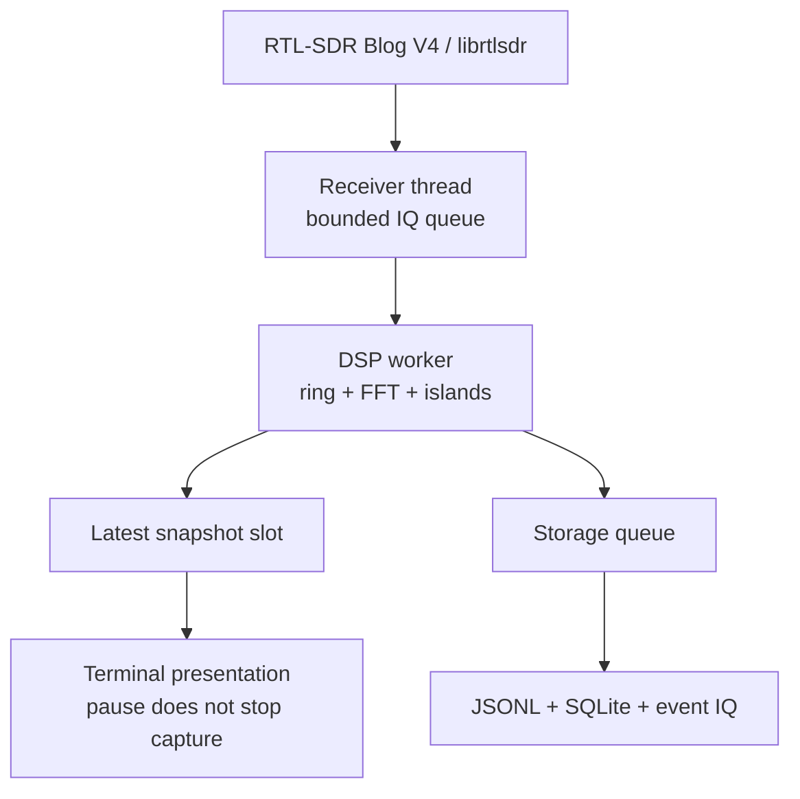

# AIRWAV

**Observe first. Conclude second.**

[](https://github.com/chasebryan/airwav/actions/workflows/ci.yml)
[](LICENSE)
[](rust-toolchain.toml)

A native Rust terminal for **passive RF observation**, built exclusively for the **RTL-SDR Blog V4**. No generic SDR backend, browser, cloud service, or transmitter support.

AIRWAV measures what the receiver actually produces. It does not invent aircraft, identities, protocol confidence, decoder output, PRISM channels, or MAX-I scores.

## Status

| | |
| --- | --- |
| Milestone | Capture foundation (not a production receiver release) |
| Hardware | V4 identity/ABI tests exist; **physical V4 acceptance is outstanding** |
| Decoders | None. Detected activity is `UNKNOWN` |
| Default window | Manual observation until autonomous scheduling is verified |

Run the [hardware acceptance procedure](docs/hardware-acceptance.md) before production receiver work. See the [milestone ledger](docs/roadmap.md) for remaining gates.

## Browser DEMO FIXTURE

[`web/`](web/) is an optional observer of **synthetic IQ** — the same class of fixture the native `make_fixture` example writes. It is **not** a live receiver, does not load librtlsdr, does not talk to USB, and is not a supported production interface. Detected activity stays `UNKNOWN`.

```bash
cd web
npm install
npm run dev
```

## What this milestone includes

- Fail-closed V4 hardware boundary (USB identity, R828D, clock checks)
- Hann FFT, spectral averaging, local-noise Signal Islands
- Bounded pre/post-trigger IQ capture and indexed AWR recordings
- Integrity hashes, crash-safe journals, offline replay
- Terminal AM / mono FM / narrow FM listening, plus offline WAV export with evidence metadata
- Native terminal: spectrum, measured waterfall, evidence, five themes, SVG export

## Architecture



Six crates, split on execution and trust boundaries — not on product names:

| Crate | Responsibility |
| --- | --- |
| `airwav-core` | Validated configuration, receiver identity, IQ blocks, measurements |
| `airwav-v4` | The only unsafe/FFI code; librtlsdr loading, V4 validation, streaming |
| `airwav-dsp` | Deterministic FFT, noise estimate, Signal Island history, IQ ring, audio demodulation |
| `airwav-record` | AWR journals, SQLite index, BLAKE3 artifacts, recovery |
| `airwav-ui` | Ratatui rendering, input, themes, cell-buffer SVG export |
| `airwav-app` | CLI, workers, terminal lifecycle, replay timing, paths |

Details: [architecture](docs/architecture.md) · [DSP](docs/dsp.md) · [AWR format](docs/recording-format.md) · [safety](docs/safety.md)

## Build and run

Linux, Rust 1.98 or newer, and a C compiler. The executable **builds and replays recordings without librtlsdr**. Live capture loads the V4-capable library at runtime. SQLite is bundled.

```bash
cargo build --release --locked
cargo install --path crates/airwav-app --locked
airwav doctor
airwav
```

For Fedora/i3, follow [Linux setup](docs/linux.md). Use a truecolor terminal with mouse reporting. Minimum size: **70 × 22** cells.

```bash
airwav --center-hz 136000000
airwav devices
airwav doctor --stream-seconds 30 --counter-test
airwav config --init
airwav capture session.awr --seconds 20
airwav inspect session.awr
airwav audio session.awr --mode am --output voice.wav --play
airwav replay session.awr
airwav replay session.awr --headless
airwav demo session.awr
airwav export session.awr --output screenshot.svg
airwav recover interrupted.awr --output recovered.awr
```

`doctor --counter-test` captures the receiver's hardware counter, not RF. It checks modulo-256 continuity and does not record counter bytes as observations. In normal RF mode librtlsdr does not expose USB loss; AIRWAV reports that limitation separately from measured application queue drops.

## Terminal controls

| Input | Operation |
| --- | --- |
| ↑ / ↓, click signal | Select a Signal Island |
| Enter / I, double/right click signal | Inspect measured evidence |
| A, Listen/Mute button | Listen to the selected island (or receiver center); press again to mute |
| M, Mode button | Cycle AM / FM / NFM; mode is selected manually |
| 9 / 0, volume buttons | Lower / raise audio volume (starts at 50%) |
| R, Record button | Start/stop metadata recording |
| C, Capture IQ button | Preserve available pre-trigger IQ and configured post-roll; recording must be active |
| Space, Pause button | Pause presentation; live capture continues |
| + / −, wheel over spectrum | Zoom |
| ← / →, Shift+wheel | Pan |
| D / E / ? | Diagnostics / event list / contextual help |
| T | Cycle Midnight, Radar, Arctic, Ember, Studio |
| F10 | Presentation-only Demo Mode |
| F12, Save button | SVG cell-buffer screenshot with JSON metadata |
| Q, Quit button | Stop capture, finalize recording, restore terminal |
| Esc, Close button | Close overlay |
| Replay 1 / 2 / 3 / 4 / 5 | 0.25× / 0.5× / 1× / 2× / 4× |
| Replay . | Step one measurement |
| Replay [ / ], event buttons | Jump to previous/next captured event |

Audio starts off: select a signal, choose AM/FM/NFM with M, then press A or click Listen. The audio line shows the locked frequency, PCM level, missing input and stalled output; Diagnostics includes peak/clipping counts and player errors; mute and listen again to select another signal. Replay listening plays the nearest captured IQ event at normal speed, independently of visual replay controls. See [audio setup and troubleshooting](docs/audio.md). Physical V4/audio acceptance remains outstanding. Full context menus, range dragging, and receiver locking/retuning remain on the roadmap.

## Deterministic development fixture

The synthetic preview is **explicitly labeled DEMO FIXTURE**, is generated from IQ, and cannot be selected as a live receiver. It contains tones, drift, bursts, and seeded noise. It makes no decoder claims.

```bash
cargo run --release --example make_fixture -- /tmp/airwav-demo.awr
airwav replay /tmp/airwav-demo.awr
airwav export /tmp/airwav-demo.awr --output /tmp/airwav-demo.svg
```

## Configuration and data

Defaults: `~/.config/airwav/config.toml` and `~/.local/share/airwav/`. XDG variables are respected. `AIRWAV_CONFIG` and `AIRWAV_DATA_DIR` override these paths. `--config` and `--library` select explicit paths. Missing configuration uses validated defaults. Unknown TOML fields are errors.

The default 2.56 MS/s IQ ring holds at most **25.6 MB** for five seconds; post-trigger capture is ten seconds. It stores raw unsigned 8-bit IQ, not floating-point copies. Recording stops at its configured size/free-space thresholds. It never automatically deletes old captures. At 2.56 MS/s, raw IQ costs 5.12 MB/s; continuous recording is deliberately not enabled in this milestone.

## Verification

```bash
make check
```

Or the expanded form:

```bash
cargo fmt --check
cargo clippy --workspace --all-targets --all-features -- -D warnings
cargo test --workspace --locked
cargo bench -p airwav-dsp --bench pipeline
python3 tools/smoke-tui.py target/release/airwav /tmp/airwav-demo.awr
```

Tests cover strict device identity, driver clock checks, ABI contracts, counter gaps, bounded queue saturation, disconnect/reopen and shutdown races, numerical DSP, property-tested rings, AWR corruption and recovery, database migrations, terminal sizing, and production/fixture separation.

See [validation results](docs/validation.md) and [CONTRIBUTING](CONTRIBUTING.md).

## License

[GNU AGPL v3](LICENSE). The user-installed RTL-SDR Blog driver is a separate dependency; AIRWAV does not vendor its implementation.
