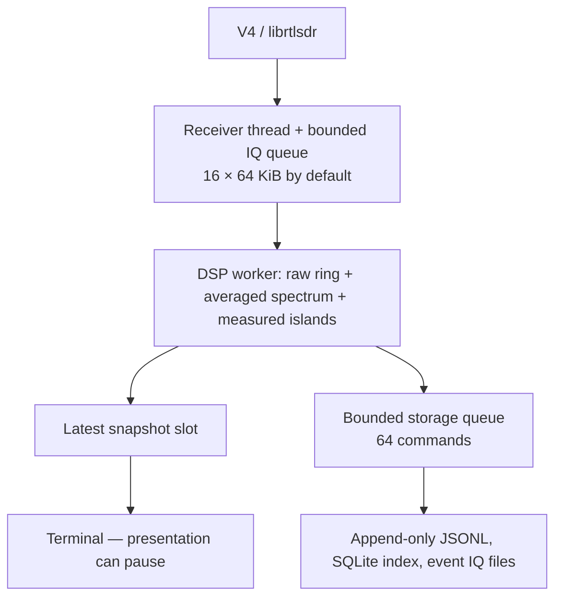

# Architecture

AIRWAV is a seven-crate Rust workspace. Crates divide execution and trust boundaries, rather than creating a crate per product name.

| Crate | Responsibility |
| --- | --- |
| airwav-core | Validated configuration, receiver identity, IQ blocks, measurements, metrics |
| airwav-v4 | The only unsafe/FFI code; librtlsdr loading, V4 validation, exclusive configuration, bounded streaming |
| airwav-dsp | Deterministic FFT, noise estimate, Signal Island detection/history, bounded raw IQ ring |
| airwav-decode | CRC/parity-gated protocol modules. Silence unless the check remainder is 0 |
| airwav-record | Versioned AWR journals, SQLite index, BLAKE3 IQ artifacts, disk guards, recovery |
| airwav-ui | Ratatui rendering, input state, themes, exact cell-buffer SVG export |
| airwav-app | CLI, worker orchestration, terminal lifecycle, replay timing, paths and logs |

The receiver callback only validates a buffer, checks the optional diagnostic counter, copies bytes, advances sample positions, and tries a nonblocking send. It never waits for terminal rendering or disk I/O. The callback boundary catches unwinding; no Rust panic crosses C. Allocation is per admitted block; retained block counts are bounded by the queue, ring, storage queue and one event in flight. There is no thread per detected signal.

Application queue saturation counts the exact lost complex samples and preserves their positions in the next admitted block. The DSP resets partial FFT state and the ring at a gap. Storage saturation drops metadata snapshots and event IQ with separate visible counters. Missing event IQ invalidates continuity; the event becomes partial and the recorder reports the error. A disk error leaves the session incomplete, keeps existing data, and disables recording. It does not halt RF observation.

The UI receives snapshots at about 10 Hz. Its mutex only protects a small snapshot/message copy; rendering happens after releasing the lock. Storage has its own worker. DSP duration measures conversion, FFT, detection and ring maintenance for the last block. Normal RF mode cannot quantify USB losses: the field remains `null`, never zero.

Shutdown sets an out-of-band stop flag, cancels librtlsdr, joins the capture worker, drains storage, and finalizes intact journals. librtlsdr cancellation is the only operation allowed concurrently with read_async. Repeated cancellation closes the cancel-before-read race. A driver stuck after two seconds retains its handle/library on the worker rather than freeing live FFI state. Disk synchronization can still block on a failed filesystem; no application can guarantee completion of a kernel I/O operation.

SQLite schema v1 uses WAL, FULL synchronization, explicit migrations and immutable observation/event triggers. JSONL is the portable recovery source; SQLite is a rebuildable index. RF facts are not revised in place. Session manifests contain source identity and receiver configuration. A future multi-receiver session must model multiple V4 units only.

This milestone retunes the V4 while `read_async` is running (`rtlsdr_set_center_freq` is documented as safe during streaming) and resets DSP/decoder epochs on every successful retune. Decoder output is CRC/parity evidence or UNKNOWN. There is still no MAX-I scheduler or enrichment layer. See [roadmap.md](roadmap.md) for remaining gates.
